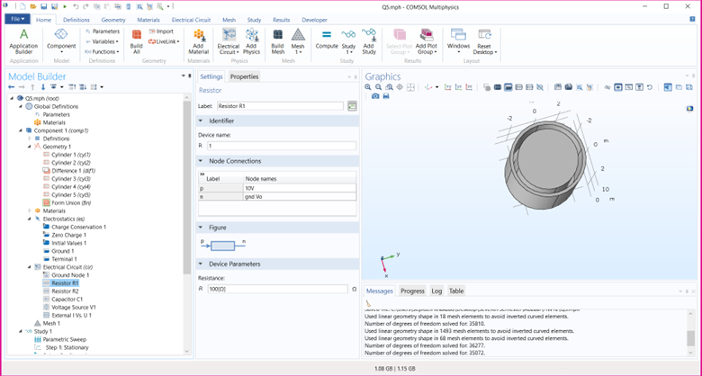
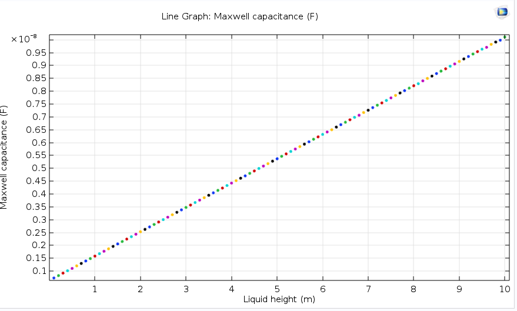

# Capacitance Measurement and Control System
## Introduction
This repository presents a Capacitance Measurement and Control System based on the principles of electrostatics. The system explores the relationship between the internal and external radii, denoted as alpha, of concentric cylinders. Using the electrostatic theory and defining ground and terminal capacitances, we observe the formation of a capacitor with a liquid medium between the plates.

## Methodology
The geometry is illustrated using Comsol Software. The "Electrostatic" physics is utilized and the ground and terminal plates are determined.

<p align="center">
  
</p>

The linear relationship of the capacitance with respect to the Liquid height (L) is established for a constant alpha.
This result complies with capacitance equations which are as follows:

$$
\begin{aligned}
q=\varepsilon \cdot E A= \varepsilon \cdot E(2 \pi r L) \quad E=\frac{q}{2 \pi \varepsilon r L}
\end{aligned}
$$

$$
\begin{aligned}
& V=\int_{-}^{+} E d s=-\frac{q}{2 \pi \varepsilon_0 L} \int_{R_1}^{R_2} \frac{d r}{r}=\frac{q}{2 \pi \varepsilon_0 L} \ln \left(\frac{R_2}{R_1}\right) \xrightarrow{q=CV} \\
& C=2 \pi \varepsilon_0 \frac{2}{\ln \left(\frac{R_2}{R_1}\right)}
\end{aligned}
$$


To increase the sensitivity to height changes, the derivative of the capacitance with respect to L is calculated using MATLAB.


```syms alpha L C;
  C = 2 * pi * 20 * L / log(alpha);
  dC = diff(C, L);
```

Result is:

$$\begin{aligned}
  dC = \frac{40 \pi}{log \alpha}
  \end{aligned}
$$ 

The result shows that alpha should be as large as possible for increased sensitivity. The maximum of alpha can be 1, however, to maintain a stable capacitor structure, we set alpha to 0.9 since the graphical representation indicates that higher alphas lead to turbulent and unpredictable capacitor shapes.
The output using alpha = 0.9 is illusterated below:

<p align="center">
  
</p>


## Voltage Control
To ensure the output voltage falls within the 0 to 5 range, suitable for microcontroller ADC inputs, the following equations are solved:

```
eqns = [((C1/(456+C1))-(R3/(R3+100)))+0.5==0, (C1/(40+C1))-(R3/(100+R3))==0];
vars = [C1 R3];
[solC1, solR3] = solve(eqns, vars);
```

The resulting design is implemented in Altium Designer, and the C code for reading voltage on ADC and displaying height on an LCD is provided.

Implementation - C Code: (The rest is as main.cpp)

```#include <avr/io.h>
  #include <util/delay.h>
  #include "lcd.h"

  #define LTHRES 500
  #define RTHRES 500

  // ... (Code for ADC initialization, reading, and LCD display)

  int main()
  {
      // ... (Initialization and setup)

      while(1)
      {
          // ... (ADC reading and LED control)

          // Display on LCD
          itoa(adc_result0 * (AREF / 128), int_buffer, 10);
          lcd_gotoxy(12, 0);
          lcd_puts(int_buffer);
          _delay_ms(50);
      }
  }
```

Note: The prescaler is set to 128, and the ADC response is divided by this value. The result is then multiplied by the reference voltage (AREF/128) to obtain the height value.