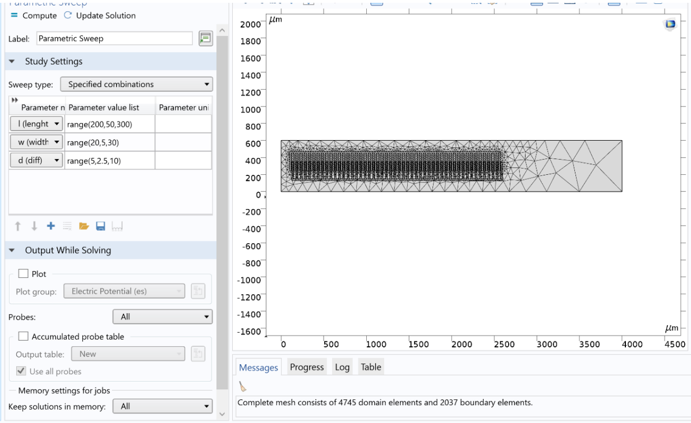

# Capacitive Sensor Design and Simulation

We have illustrated a number of capacitive sensor shapes and connected their relevant parts. For the first sensor, we drew the sensor shape, assuming the rectangular bottom is made of air, and the capacitor itself is made of copper. We considered a relative permittivity of 16e1.

  

## Electrostatic Physics

In the electrostatic physics section, we assigned the upper plate as Terminal 1 with 1 volt, and the lower plate as Ground. The meshing was configured as shown below.

  

## Parameter Definition and Study
We defined the parameters that we wanted to observe for their impact on capacitor capacitance as variables. The Study Stationary section, as shown below, was utilized for examination.

  

## Simulation Results
The x-axis was set as the variable being swept, and the y-axis as the capacitor capacitance. The output is depicted below, illustrating the final response.

  

## Second Sensor
For the second sensor, we created a cubic space surrounding the sensor, as shown below.

  

Then, we created two blades, completed the shape using the Array tool and two additional blades, and formed the next shape using the union operation as follows:

  

  

Two materials were defined as depicted in below, and electrostatic physics were employed. 

  

Two terminals with voltages of 0 and 10 volts were considered. The meshing was done with fine extra configuration, as shown below:

  

Variables to be swept were defined, and a stationary Study was conducted with parameter ranges as specified in the question. The output is presented below:

  

