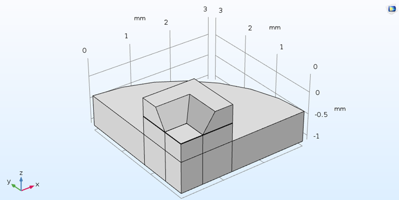
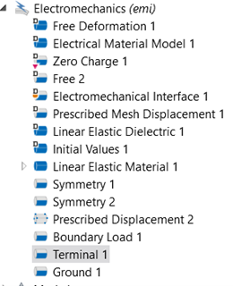
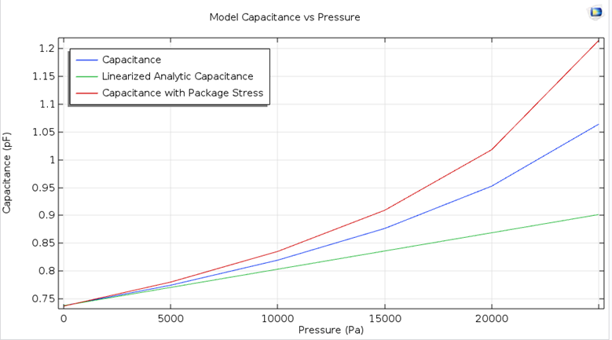

# Diaphragm Sensor

The geometry of the diaphragm sensor is depicted below, with only half of it shown due to symmetry.

  

The upper surface is made of silicon, while the lower surface is constructed from steel. A cavity is considered as the material on the diaphragm surface. The settings are set as below:

  

The physics employed in electromechanics involve the displacement and load applied to the diaphragm surface, taking into account the symmetry in the shape. Additionally, a voltage difference is applied to both sides of the diaphragm surface.

Finally, the response of changes in capacitance concerning the applied pressure will be as follows:

  

