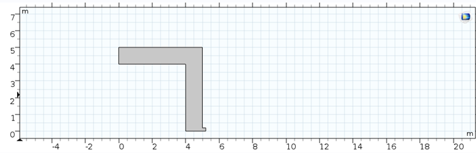
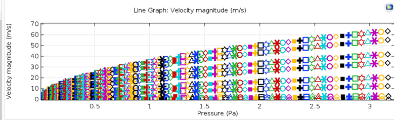

# Fluid Flow Simulation using COMSOL

## Geometry
We have drawn the geometry in the shape of two squares inside each other using the "difference" operation. The smaller square at the end is intended for considering the output for fluid flow:

  

## Material Specification
We specified the properties of air in the "material blank" section.

##Flow Creeping Physics
The "flow creeping" physics was added, and at the inlet, a flow defined in the parameter section was assigned. The output was considered, and the mesh was created. The study was set as stationary, and the flow was swept.

##Results
The final result is depicted below, showing the flow versus pressure difference graph.

  

Observing the graph, it can be noted that the relationship between flow and pressure difference is as desired, following a radical pattern.

