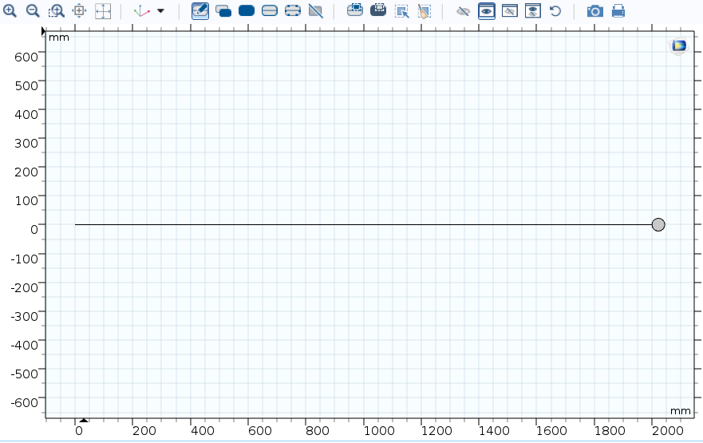
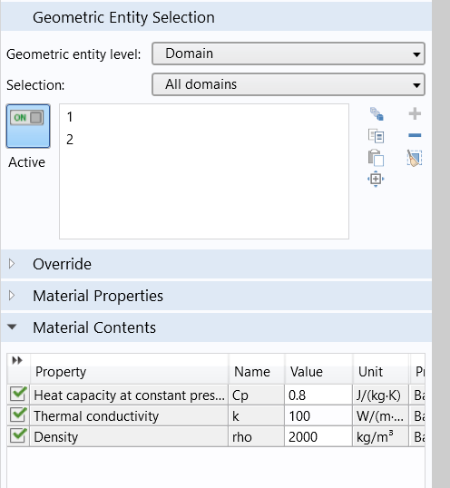
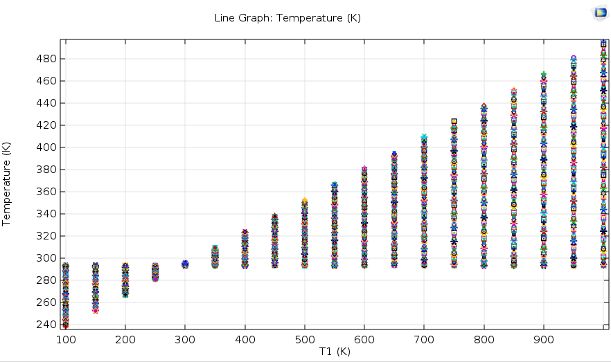

# Heat Transfer in Solids

We calculate and display heat transfer in a rode and beam setting using Comsol Software while considering the homogeneity of the two. 

### Drawn Geometry:
The system is a rode and beam with $r=22mm$

  

### Material Selection

We selected the Material as blank and, we assigned constants as shown below to comply with our material of choice:

  

### Physics

For physics, we chose Heat transfer in solids and entered $T_1$ at the left end of the rod. We defined $T_1$ in the parameters section and then performed a sweep.

  

### Mesh Selection

We considered the mesh as normal and physics controlled.

### Study Settings

We selected the study as time-dependent, considering a transfer time of 100. Also, after 200 seconds, the same result will be obtained, so 100 seconds will be sufficient for heat to transfer from the end of the rod to the sphere.

In this study, with a parametric sweep, we swept the initial temperature and observed the output response,

### Result
We observe a linear response compatible with the heat transfer equation in solids ([Heat Transfer eqaution](https://doc.comsol.com/5.5/doc/com.comsol.help.heat/heat_ug_theory.07.07.html)).

Additionally, since we initially considered the temperature of the sphere as 293 Kelvin, when $T_1$ is less than this value, the temperature of the sphere also decreases.

  

Simulation file can be found in the repo.