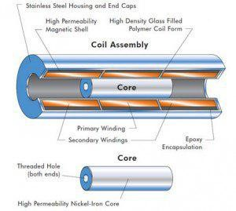
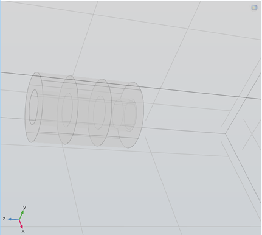
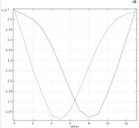
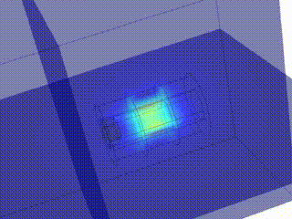

# LVDT (Linear Variable Differential Transformer) Sensor

LVDT, short for "Linear Variable Differential Transformer," is a common type of electromechanical transducer capable of converting linear movement or displacement into an electrical signal.

## Internal Structure of LVDT

The internal structure of an LVDT consists of a primary coil placed between a pair of secondary coils, all wound uniformly. These coils are spaced symmetrically around the primary coil. The coils are placed on a mechanically and thermally reinforced polymer piece, which is magnetically insulated. This assembly is then encased in a steel housing. The provided parameters in the attached figure, labeled as A (representing the length of the sensor body) and B (representing the length of the core), define the fixed part of the LVDT sensor.

The movable part of an LVDT includes a steel rod, referred to as the core, made of magnetic material. This core can move freely inside a cylindrical coil assembly, as described earlier. The piston, connected to the piece whose displacement needs to be measured, is also attached to and moves within the cylinder. The cylinder provides enough space for the core to move without physical contact with the cylinder body.

In practice, the primary coil of the LVDT is excited by an alternating current with an appropriate amplitude and frequency. The electrical output signal of the LVDT is the difference between the voltages induced in the secondary coils, which changes with the axial displacement of the piston within the core. Typically, this AC output voltage is amplified and converted to a DC voltage or current by electronic circuits for further use.

## Implementation

Considering the desired geometry as follows:

  

we illustrated the coil in Comsol as:

  

We define the internal circle position as a variable x. Introduce the magnetic field physics and place two coils with zero excitation voltage on the upper sides and a coil with a current of 1 ampere in the middle. Sweep the variable x. The final response is:

  

  

