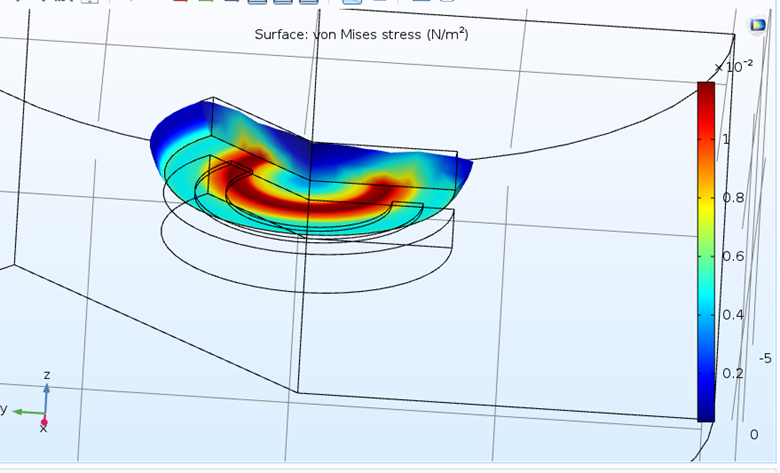

# MEMS Light Switch with Magnetic Excitation

## Design and Geometry 
A three-dimensional magnetic field influences a torque that alters the movement of a beam. We plotted the shape below in the r-phi-z plane and then revolved it in three-dimensional space. As described in the design section, there is a silicon layer beneath the surface where the coil is placed, and this layer is circular. Another silicon layer is present at a distance from the previous layer, which, due to the applied torque and force, will be deflected and alter the path of light. Additionally, a cylinder-like shape is considered as the surrounding air, larger than the entire switch, to encapsulate it.

  

## Material Specifications

The base material for silicon is considered as <100>Si, and its specifications are provided below:

  

  

## Physics

To generate a magnetic field using a coil, the magnetic fields physics was added. Due to the symmetry created in our design, the axial symmetry section was also added to the project.

  

For modeling the coil placed on the surface, we utilized the external current density and defined the current according to the figure.

  

Concerning the magnetostrictive law, details will be explained when introducing the relevant multiphysics in the next section.

Next, the Solid Mechanics physics was added to observe the deflection of the magnetostrictive layer due to the torque generated by the coil. Similarly, as in the previous physics, the axial symmetry section was added. The upper magnetostrictive layer was considered free, and the lower layer, subject to torque, was fixed to observe its deflection.

  

After adding these two physics to the project, to couple them and allow the magnetic field to affect the magnetostrictive layer, the Magnetostrictive multiphysics was added. The sections related to this multiphysics were also brought into the magnetic and solid physics.

  

  

## Meshing
Meshing was done using a Quad Free mesh on the magnetostrictive layer and a Triangular Free mesh in other regions of the geometry.

  

2.5 Simulation
Simulations were carried out on an Intel i7 core with 16 GB of RAM.
The results are as follows for 2D and 3D magnetic field, stress, strain and magnetostrictive and BH curve.

  

  

  

  

  

  

  

