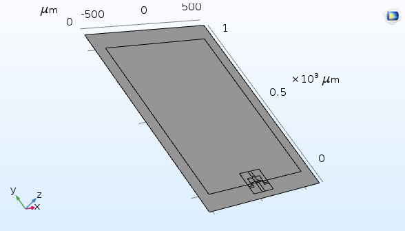
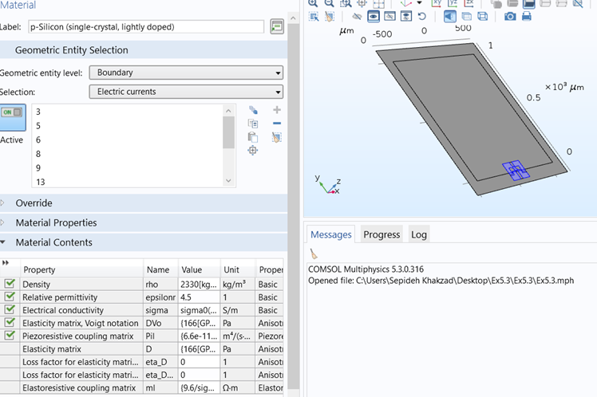
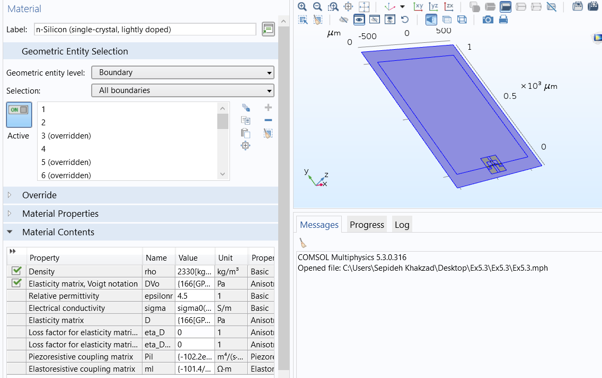
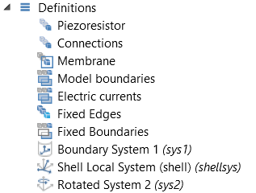
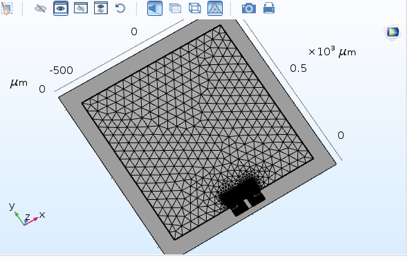
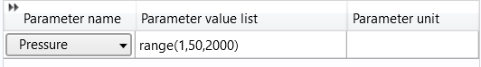
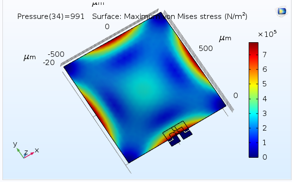
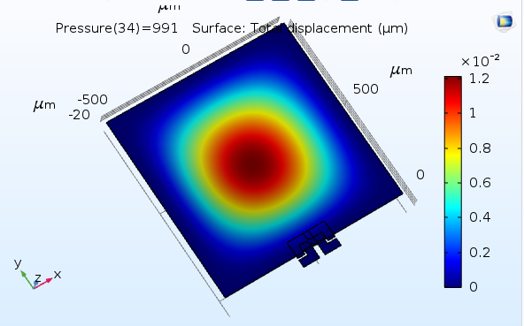
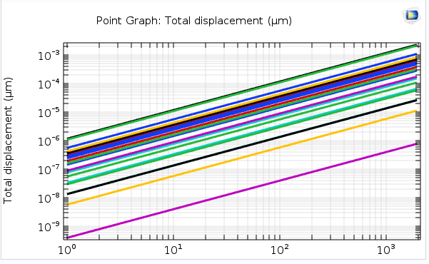

# Pressure Diaphragm Sensor Design using COMSOL
Using COMSOL software, we designed the following pressure diaphragm sensor. 

We imported a shaped-X piezoresistor, from COMSOL examples.

## Geometry
Below, the geometry of the diaphragm pressure sensor is illustrated.

  

Type-p and type-n configurations were defined in specific regions with the following densities:

  

  

## Mechanics Structural Physics
To introduce the appropriate physics, we added the "shell" option from the mechanics structural menu. In the definition section, the parameters were specified as follows.

  

Shell and shell currents electric settings were adjusted as follows.

  

We defined the mesh as a "user-defined" type, the details of which are provided in the file. The mesh shape is shown.

  

Finally, with parametric sweep within the pressure range shown and stress measurements were obtained.

  

Stress, displacement, and the displacement versus pressure graph were plotted, as shown below respectively.

  

  

  

Observing the linear response in the displacement versus pressure graph, it is evident that the sensor behaves as an ideal pressure sensor, meeting the desired criteria.

